## Ubuntu + Chrome Remote Desktop + Chrome docker image

This image is based on [Ubuntu](https://ubuntu.com/) and contains [XFCE Desktop Environment](https://www.xfce.org/), [Chrome Remote Desktop](https://remotedesktop.google.com/) and Chrome + Firefox browsers.

It enables you to connect to the container via Chrome Remote Desktop and have desktop environment with web browsing inside the container even if you can't connect to your container directly (for example, your container us running behind [NAT](https://en.wikipedia.org/wiki/Network_address_translation)).

### Env variables
* `HOSTNAME` (optional, default: `myvirtualdesktop`). The name your host will be shown under in "Remote devices" list on Chrome Remote Desktop website.
* `CODE` (required). Authorization code generated by Chrome Remote Desktop.
* `PIN` (optional, default: `123456`). PIN code that you can come up with. It will be requested when you try to connect to a container via Chrome Remote Desktop.

### Why would I want it?

The image was created for Synology NAS users. It's a common case when NAS is running behind ISP NAT and users can't directly access it outside their local network, but they still are able to access NAS via Synology Quick Connect and start Docker container. 

Chrome Remote Desktop also uses outgoing connection to Google servers, enabling users to connect to the container and browse local network or Internet from their home IP address.

The more proper option (but more tricky in setting up) is using VPN on your NAS + [ZeroTier](https://docs.zerotier.com/devices/synology/) container to get around the problem of ISP NAT.

### Synology DSM 6 instructions

* Install ["Docker"](https://www.synology.com/en-global/dsm/packages/Docker) package on your NAS and open it's UI. 
* Open "Registry" tab. Search for `cardinalby chrome-remote-desktop` image and "Download" it. 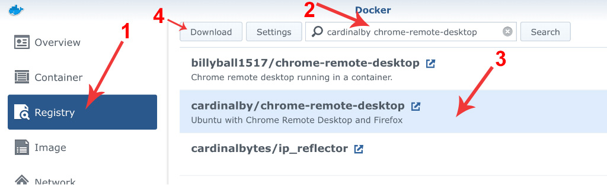.
* After the image is downloaded, open "Images" tab select the image and click "Launch" 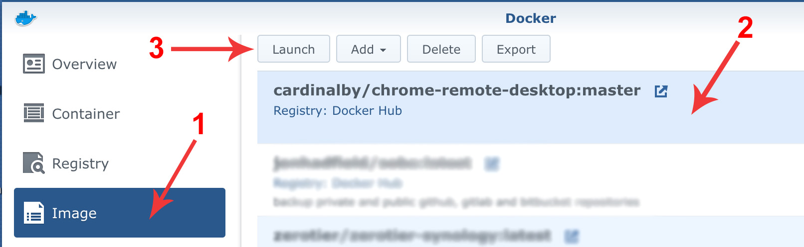.
* In the dialog window that opens click "Advanced Settings" 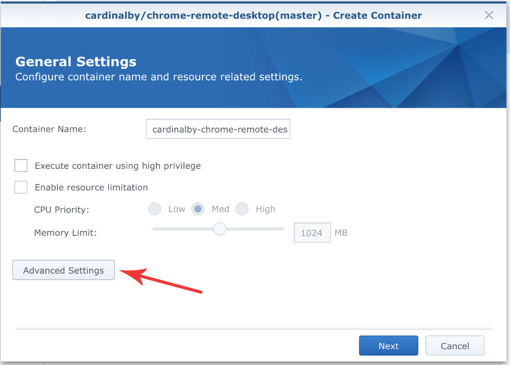.
* In "Advanced Settings" window open "Environment" tab and change the default PIN (optional). 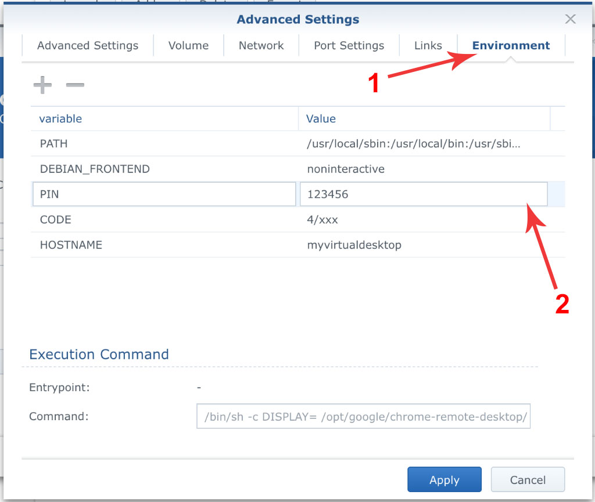. Leave the window and a browser tab opened, we will return here soon.
* Next we are going to obtain an authorization code needed to start the container. Since the code expires in a short time, do it quickly.
* Open [https://remotedesktop.google.com/headless](https://remotedesktop.google.com/headless) in a new browser tab. Click "Begin", then "Next", then "Authorize"
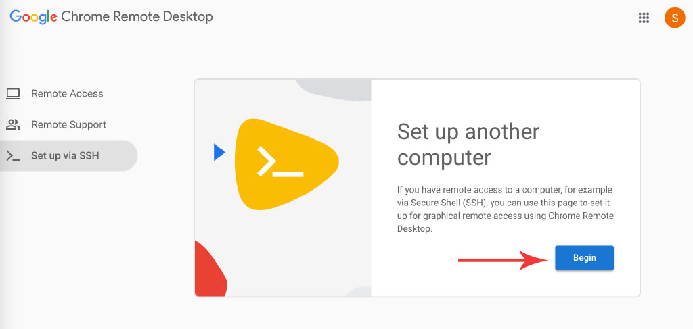.
* You will see the instructions for different OS. All we need is the long code consisting of digits + letters that is placed inside the quotes in command: `code="4/xxx"`. Copy it to the clipboard, click "Start over" 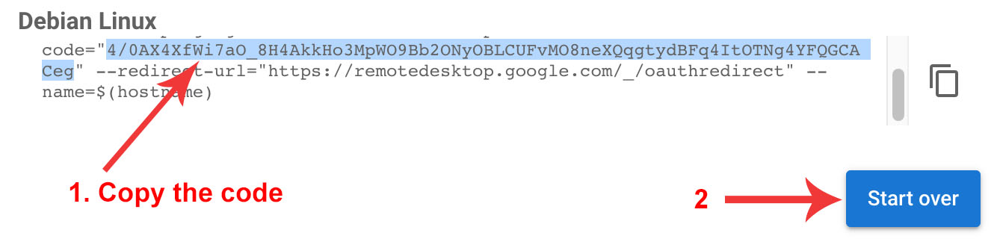.
* Get back to Synology DSM tab and insert the code as a value for corresponding env variable. Click "Apply". 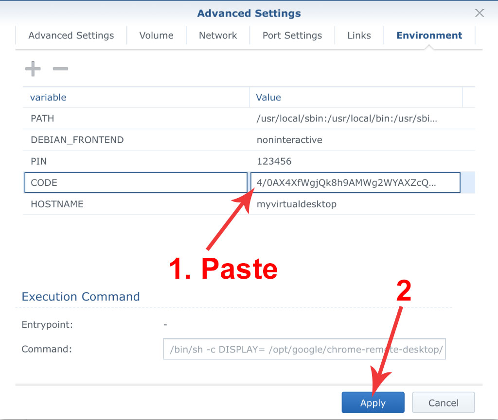.
* Click "Next" in "Create Container" dialog 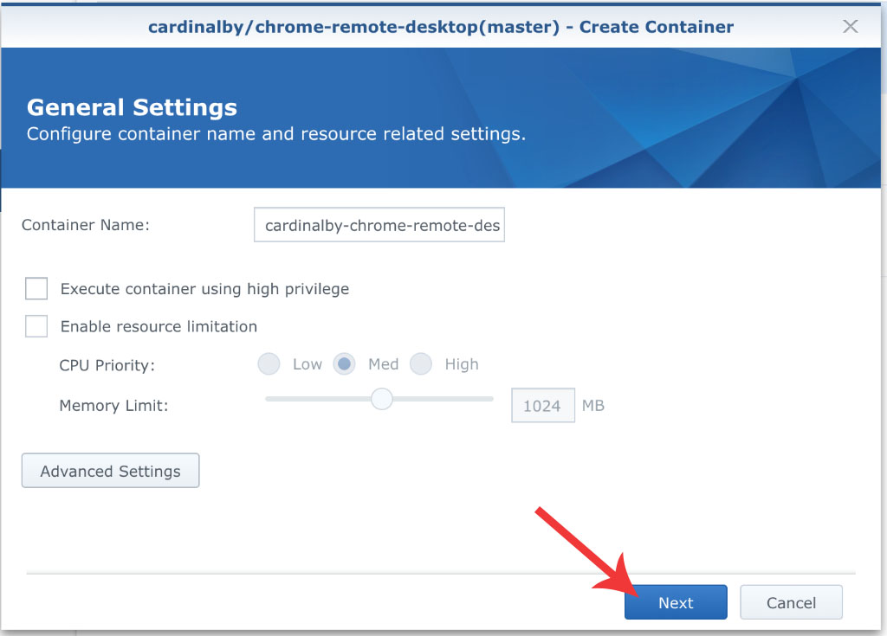.
* Ensure that "Run this container after the wizzard is finished" checkbox is set and click "Apply" 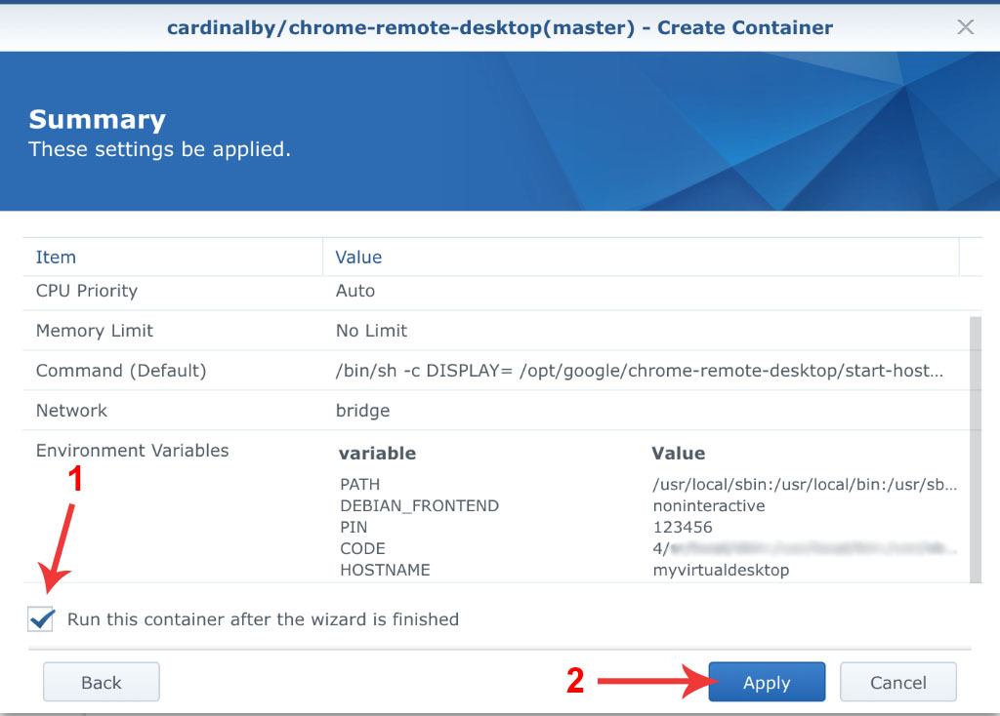.
* Wait until container starts and get back to "Chrome Remote Desktop" website. Go to "Remote Access" tab (at the left) and wait for a new machine appears in the list of remote devices. Click on it. 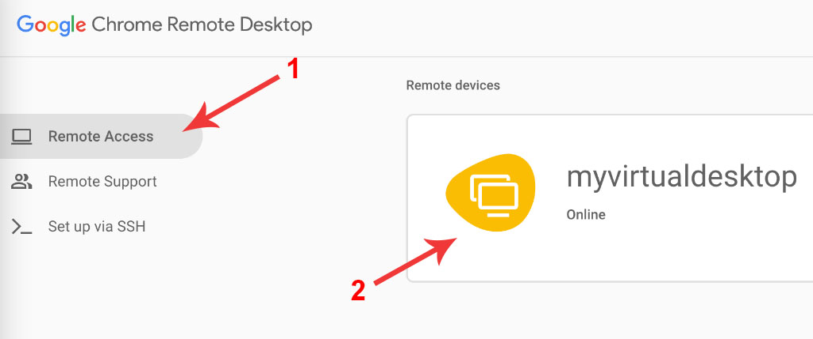.
* In the dialog enter the PIN (123456 if you didn't change the default one) and click blue arrow button. 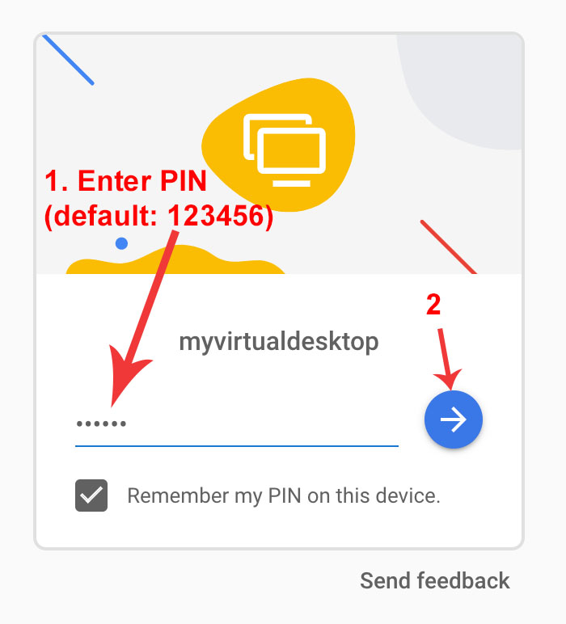.
* You should see the XFCE desktop environment of your Ubuntu Linux. You can launch Firefox browser from "Applications" - "Internet" menu. 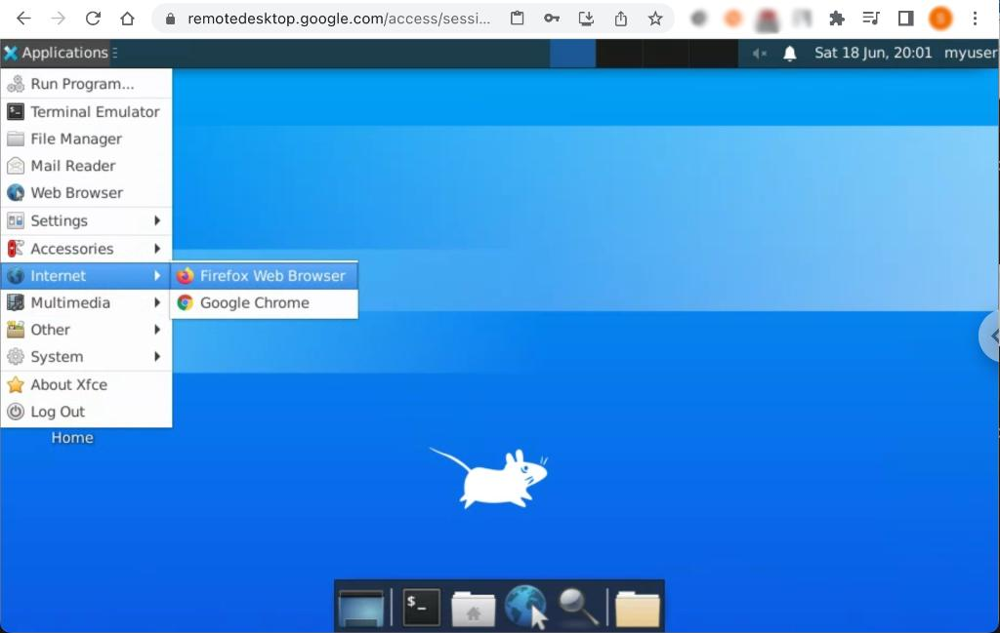.